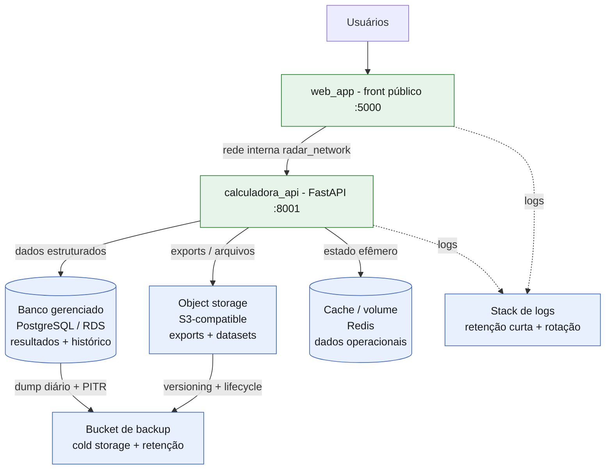

# Diagrama — Arquitetura de armazenamento proposta (Radar ENEM)

Diagrama em Mermaid. Renderiza automaticamente no preview do Kiro/VS Code
(com extensão Mermaid) e em geradores de PDF que suportam Mermaid.

## Legenda / decisões

| Destino | Tipo de dado | Por quê |
|:--------|:-------------|:--------|
| Banco gerenciado (PostgreSQL/RDS) | Resultados estruturados e histórico | Consultas, integridade e escrita concorrente segura |
| Object storage (S3) | Exports, datasets, backups | Arquivos grandes e imutáveis, baratos e escaláveis |
| Cache / volume (Redis) | Estado operacional / efêmero | Baixa latência, não precisa de durabilidade longa |
| Bucket de backup (cold) | Cópias de segurança | Fica fora da produção, retenção por política |
| Stack de logs | Logs | Alto volume, valor cai rápido, retenção curta |
